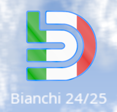
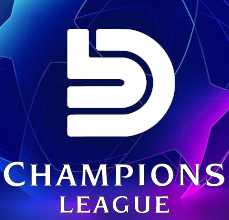

# nacithopheps

<!DOCTYPE html>
<html>

  <head>
    <meta charset="utf-8">
    <meta name="viewport" content="width=device-width, initial-scale=1">
    <title>Volta pagina, Vota Bianchi</title>
    <meta name="description" content="DBB_PROGRAMMA">
    <link rel="stylesheet" href="pico.min.css">
    <link rel="stylesheet" href="custom.css">
  </head>

  <body>

    <!-- Hero -->
    

      <nav class="container-fluid">
      </nav>
      <header class="container">
        <hgroup>
          <h1>VOLTA PAGINA, VOTA BIANCHI</h1>
          <h2>alle elezioni per il rappresentante d'istituto dell'anno scolastico 2024/2025.</h2>
        </hgroup>
      </header>
    
<!-- ./ Hero -->

    <!-- Main -->
    <main class="container">
      

        <section>
          <hgroup>
            <h2></h2>
            <h3></h3>
          </hgroup>
         
          <h2></h2>
          <figure>
            
          </figure>
         
          <h1>Vota Davide Bertrand Bianchi come rappresentante d'istituto</h1>
          
          <h3>Cari amici, quest'anno è già iniziato ma è ancora lungo e insieme potremmo renderlo una pietra miliare nella storia dell'istituto Alessandro Volta, le mie proposte sono aperte alle vostre idee e ai vostri suggerimenti, sarò felice di confrontarmi con tutti voi per rendere il mio programma perfetto per questo istituto.</h3>
          
          <h3>Nei due anni che ho trascorso in questa scuola mi sono reso conto di quanto sia importante il nostro istituto, poiché raccoglie studenti da Casole a Castelfiorentino, da Monteriggioni a Poggibonsi, persone distanti decine di chilometri che ogni mattina arrivano fino a Colle per istruirsi e affermarsi nel mondo di domani.</h3>
         
          <h3>Questo percorso rappresenta per noi un momento di passaggio, una parte fondamentale della nostra vita, perché non dovremmo aspirare al meglio per noi stessi e per il nostro istituto?</h3>
          
          <h3>Voi potete aiutarmi a rendere questi anni della vostra vita più intensi ed emozionanti, ed il vostro aiuto è un gesto molto piccolo, ma molto potente, il vostro voto conta, basta solo un voto, un nome, per rendere questo anno indimenticabile.</h3>
          
          

          
        </section>

        <aside>
               <!--  -->
          
          

            <a href="proposte.html" >Proposte</a> 
            <small>Le mie proposte per l'anno scolastico 2024/2025.</small>
          

       
           
          

            <a href="torneo.html" >Volta Champions League</a> 
            <small>Propongo un torneo a classi, studiato per essere il più equilibrato possibile.</small>
          

        
        </aside>

      
      

    </main><!-- ./ Main -->

 
    <!-- Minimal theme switcher -->
   

 
    <video src="assets/video_spot.mp4" width=1260  height=620 controls poster="monogra7.png">
     Il video non può essere riprodotto sul tuo browser. 
    <a href="assets/video_spot.mp4">video_spot_elettorale</a>. 
    </video>
 
    <section>
    <h3>         Quest'anno sarà straordinario.</h3>
    </section>
  
  </body>

</html>
